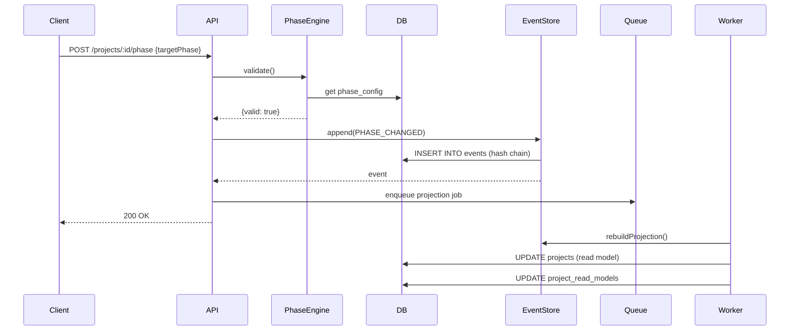

# IncentivFlow — Event Sourcing Architecture (Production)

## Visão Geral

Sistema implementado com **Event Sourcing + CQRS** real, garantindo:
- ✅ Auditoria imutável com hash chain criptográfico
- ✅ Phase engine dinâmica via config
- ✅ Multi-tenancy com RLS nível banco
- ✅ Read models otimizados
- ✅ Replay completo de eventos

---

## 1. Event Sourcing (Source of Truth)

### Tabela `events`
```sql
id              uuid PK
organizationId  uuid FK
aggregateId     uuid (projectId)
aggregateType   varchar
type            varchar (PROJECT_CREATED, PHASE_CHANGED, etc)
version         int (sequencial por aggregate)
payload         jsonb
metadata        jsonb
prevHash        char(64)
hash            char(64) 
createdAt       timestamptz
```

**Hash Chain:**
```typescript
hash = SHA256(prevHash + JSON.stringify({type, payload, version, timestamp}))
```

**Verificação de integridade:**
```typescript
const { valid, brokenAt } = await EventStore.verifyChain(projectId);
// Recalcula todos os hashes e compara
```

### Eventos de Domínio
1. `PROJECT_CREATED` - Projeto criado
2. `PROJECT_UPDATED` - Dados alterados
3. `PHASE_CHANGED` - Transição de fase
4. `VALUE_APPROVED` - Valor aprovado
5. `VALUE_CAPTURED` - Captação registrada
6. `DOCUMENT_ADDED` - Documento anexado
7. `PROTOCOL_ASSIGNED` - Protocolo obtido
8. `CLIENT_APPROVED` - Cliente aprovou

---

## 2. CQRS - Read Models

### Write Model
- **Tabela:** `events` (append-only)
- **Operações:** Apenas INSERT
- **Validação:** PhaseEngine + regras de negócio

### Read Models (Projections)
1. **projects** - Projeção principal
2. **project_read_models** - View materializada para queries rápidas

**Worker de Projeção:**
```typescript
// apps/api/src/workers/projection.worker.ts
new Worker('projections', async (job) => {
  const state = await EventStore.rebuildProjectProjection(aggregateId);
  await prisma.project.update({ where: {id}, data: state });
  await updateReadModel(id, state);
});
```

**Rebuild completo:**
```bash
# Replay todos os eventos para reconstruir estado
npm run projections:rebuild
```

---

## 3. Phase Engine Config-Driven

### Tabela `phase_configs`
```sql
id              uuid
organizationId  uuid (null = global)
fromPhase       enum
toPhase         enum
rules           jsonb
version         int
isActive        boolean
```

**Exemplo de regra:**
```json
{
  "conditions": [
    {
      "type": "min_documents",
      "value": 2,
      "message": "Mínimo 2 documentos"
    },
    {
      "type": "approved_value",
      "message": "Valor aprovado obrigatório"
    },
    {
      "type": "captured_percentage",
      "value": 0.8,
      "message": "Captação mínima 80%"
    }
  ],
  "requiredFields": ["protocolNumber", "approvedAt"]
}
```

**Validação:**
```typescript
const validation = await PhaseEngine.validate(
  projectId,
  'POS_APROVACAO',
  organizationId
);
// → { valid: false, errors: ['Valor aprovado...'] }
```

---

## 4. Row-Level Security (RLS)

### Políticas PostgreSQL
```sql
ALTER TABLE projects ENABLE ROW LEVEL SECURITY;

CREATE POLICY tenant_isolation ON projects
  USING (organization_id = current_setting('app.org_id')::uuid);
```

**Uso na API:**
```typescript
await RLS.withTenant(orgId, userId, async () => {
  // Todas as queries aqui são automaticamente filtradas
  const projects = await prisma.project.findMany();
  // → WHERE organization_id = orgId (aplicado pelo Postgres)
});
```

---

## 5. Fluxo Completo - Mudança de Fase



---

## 6. Estrutura de Pastas

```
/apps/api/src
  /core
    prisma.ts          # Client + audit context
    rls.ts            # Row-level security
    rbac.ts           # Permissions
    auth.ts           # JWT
  /modules
    /events
      event.store.ts  # Event sourcing core
    /phase
      phase.engine.ts # Config-driven validation
    /project
      project.service.ts # Write model
    /audit
      audit.service.ts
  /workers
    projection.worker.ts # CQRS projections
    queue.ts
  server.ts           # Fastify API

/packages/db
  schema.prisma       # Event sourcing schema
```

---

## 7. Comandos

```bash
# Setup
cd packages/db
npx prisma migrate dev --name init_event_sourcing

# Seed phase configs
SEED_PHASES=true npm run dev:api

# Start workers
START_WORKERS=true npm run dev:api

# Verificar integridade
curl -H "Authorization: Bearer $TOKEN" \
  http://localhost:3000/api/projects/:id/events
# → { chainValid: true }
```

---

## 8. Garantias

✅ **Imutabilidade:** Eventos nunca são alterados (só INSERT)  
✅ **Audit Trail:** Hash chain detecta qualquer tampering  
✅ **Replay:** Estado pode ser reconstruído a qualquer momento  
✅ **Multi-tenant:** RLS impede vazamento entre organizações  
✅ **Escalável:** Read models desacoplados do write  
✅ **Flexível:** Regras de fase via config (sem deploy)  

---

## 9. Próximos Passos

1. **Snapshots:** Salvar estado a cada 100 eventos
2. **Event versioning:** Migrar eventos antigos
3. **Projeções adicionais:** Dashboard, relatórios
4. **Saga pattern:** Transações distribuídas
5. **Event streaming:** Kafka para eventos cross-service